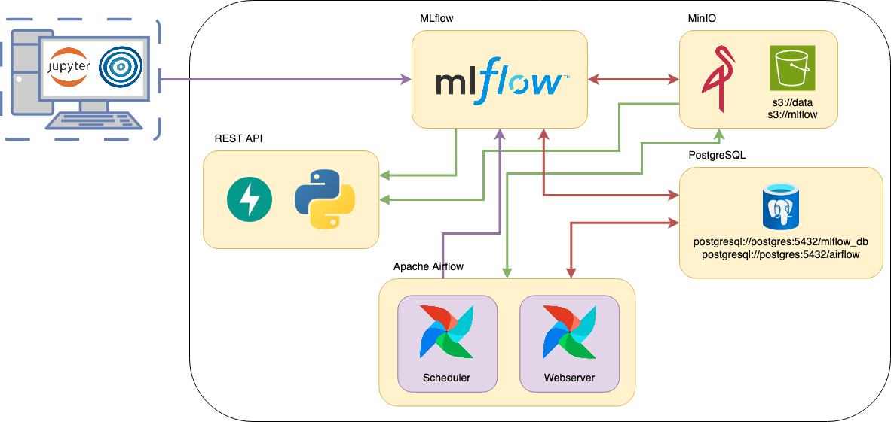

<<<<<<< HEAD
# Ejemplo de ambiente productivo
### AMq2 - CEIA - FIUBA
Estructura de servicios para la implementación del proyecto final de AMq2 - CEIA - FIUBA

Supongamos que trabajamos para **ML Models and something more Inc.**, la cual ofrece un servicio 
que proporciona modelos mediante una REST API. Internamente, tanto para realizar tareas de 
DataOps como de MLOps, la empresa cuenta con varios servicios que ayudan a ejecutar las 
acciones necesarias. También dispone de un Data Lake en S3, para este caso, simularemos un 
S3 utilizando MinIO.

Para simular esta empresa, utilizaremos Docker y, a través de Docker Compose, desplegaremos 
varios contenedores que representan distintos servicios en un entorno productivo.

Los servicios que contamos son:
- [Apache Airflow](https://airflow.apache.org/)
- [MLflow](https://mlflow.org/)
- API Rest para servir modelos ([FastAPI](https://fastapi.tiangolo.com/))
- [MinIO](https://min.io/)
- Base de datos relacional [PostgreSQL](https://www.postgresql.org/)


Por defecto, cuando se inician los multi-contenedores, se crean los siguientes buckets:

- `s3://data`
- `s3://mlflow` (usada por MLflow para guardar los artefactos).

y las siguientes bases de datos:

- `mlflow_db` (usada por MLflow).
- `airflow` (usada por Airflow).

## Tarea a realizar

La tarea es implementar el modelo que desarrollaron en Aprendizaje de Máquina I en este 
ambiente productivo. Para ello, pueden usar y crear los buckets y bases de datos que 
necesiten. Lo mínimo que deben realizar es:

- Un DAG en Apache Airflow. Puede ser cualquier tarea que se desee realizar, como 
entrenar el modelo, un proceso ETL, etc.
- Un experimento en MLflow de búsqueda de hiperparámetros.
- Servir el modelo implementado en AMq1 en el servicio de RESTAPI.
- Documentar (comentarios y docstring en scripts, notebooks, y asegurar que la 
documentación de FastAPI esté de acuerdo al modelo).

Desde **ML Models and something more Inc.** autorizan a extender los requisitos mínimos. 
También pueden utilizar nuevos servicios (por ejemplo, una base de datos no relacional, 
otro orquestador como MetaFlow, un servicio de API mediante NodeJs, etc.).

### Ejemplo 

El [branch `example_implementation`](https://github.com/facundolucianna/amq2-service-ml/tree/example_implementation) 
contiene un ejemplo de aplicación para guiarse. Se trata de una implementación de un modelo de 
clasificación utilizando los datos de 
[Heart Disease](https://archive.ics.uci.edu/dataset/45/heart+disease).

## Instalación

1. Para poder levantar todos los servicios, primero instala [Docker](https://docs.docker.com/engine/install/) en tu 
computadora (o en el servidor que desees usar).

2. Clona este repositorio.

3. Crea las carpetas `airflow/config`, `airflow/dags`, `airflow/logs`, `airflow/plugins`, 
`airflow/logs`.

4. Si estás en Linux o MacOS, en el archivo `.env`, reemplaza `AIRFLOW_UID` por el de tu 
usuario o alguno que consideres oportuno (para encontrar el UID, usa el comando 
`id -u <username>`). De lo contrario, Airflow dejará sus carpetas internas como root y no 
podrás subir DAGs (en `airflow/dags`) o plugins, etc.

5. En la carpeta raíz de este repositorio, ejecuta:

```bash
docker compose --profile all up
```

6. Una vez que todos los servicios estén funcionando (verifica con el comando `docker ps -a` 
que todos los servicios estén healthy o revisa en Docker Desktop), podrás acceder a los 
diferentes servicios mediante:
   - Apache Airflow: http://localhost:8080
   - MLflow: http://localhost:5000
   - MinIO: http://localhost:9001 (ventana de administración de Buckets)
   - API: http://localhost:8800/
   - Documentación de la API: http://localhost:8800/docs

Si estás usando un servidor externo a tu computadora de trabajo, reemplaza `localhost` por su IP 
(puede ser una privada si tu servidor está en tu LAN o una IP pública si no; revisa firewalls 
u otras reglas que eviten las conexiones).

Todos los puertos u otras configuraciones se pueden modificar en el archivo `.env`. Se invita 
a jugar y romper para aprender; siempre puedes volver a clonar este repositorio.

## Apagar los servicios

Estos servicios ocupan cierta cantidad de memoria RAM y procesamiento, por lo que cuando no 
se están utilizando, se recomienda detenerlos. Para hacerlo, ejecuta el siguiente comando:

```bash
docker compose --profile all down
```

Si deseas no solo detenerlos, sino también eliminar toda la infraestructura (liberando espacio en disco), 
utiliza el siguiente comando:

```bash
docker compose down --rmi all --volumes
```

Nota: Si haces esto, perderás todo en los buckets y bases de datos.

## Aspectos específicos de Airflow

### Variables de entorno
Airflow ofrece una amplia gama de opciones de configuración. En el archivo `docker-compose.yaml`, 
dentro de `x-airflow-common`, se encuentran variables de entorno que pueden modificarse para 
ajustar la configuración de Airflow. Pueden añadirse 
[otras variables](https://airflow.apache.org/docs/apache-airflow/stable/configurations-ref.html).

### Uso de ejecutores externos
Actualmente, para este caso, Airflow utiliza un ejecutor local, lo que significa que los DAGs 
se ejecutan en el mismo contenedor. Si desean simular un entorno más complejo, pueden levantar 
contenedores individuales que actúen como ejecutores utilizando 
[celery](https://airflow.apache.org/docs/apache-airflow/stable/core-concepts/executor/celery.html), lo que permitirá 
realizar procesamiento paralelo. Pueden encontrar más información sobre cómo hacerlo 
[aquí](https://xnuinside.medium.com/quick-tutorial-apache-airflow-with-3-celery-workers-in-docker-composer-9f2f3b445e4). 
Sin embargo, se decidió no implementarlo en este caso para evitar consumir más recursos.

### Uso de la CLI de Airflow

Si necesitan depurar Apache Airflow, pueden utilizar la CLI de Apache Airflow de la siguiente 
manera:

```bash
docker compose --profile all --profile debug down
```

Una vez que el contenedor esté en funcionamiento, pueden utilizar la CLI de Airflow de la siguiente manera, 
por ejemplo, para ver la configuración:

```bash
docker-compose run airflow-cli config list      
```

Para obtener más información sobre el comando, pueden consultar 
[aqui](https://airflow.apache.org/docs/apache-airflow/stable/cli-and-env-variables-ref.html).

### Variables y Conexiones

Si desean agregar variables para accederlas en los DAGs, pueden hacerlo en 
`secrets/variables.yaml`. Para obtener más 
[información](https://airflow.apache.org/docs/apache-airflow/stable/core-concepts/variables.html), 
consulten la documentación.

Si desean agregar conexiones en Airflow, pueden hacerlo en `secrets/connections.yaml`. 
También es posible agregarlas mediante la interfaz de usuario (UI), pero estas no 
persistirán si se borra todo. Por otro lado, cualquier conexión guardada en 
`secrets/connections.yaml` no aparecerá en la UI, aunque eso no significa que no exista. 
Consulten la documentación para obtener más 
[información](https://airflow.apache.org/docs/apache-airflow/stable/authoring-and-scheduling/connections.html).

## Conexión con los buckets

Dado que no estamos utilizando Amazon S3, sino una implementación local de los mismos 
mediante MinIO, es necesario modificar las variables de entorno para conectar con el servicio 
de MinIO. Las variables de entorno son las siguientes:

```bash
AWS_ACCESS_KEY_ID=minio   
AWS_SECRET_ACCESS_KEY=minio123 
AWS_ENDPOINT_URL_S3=http://localhost:90000
```

MLflow también tiene una variable de entorno que afecta su conexión a los buckets:

```
MLFLOW_S3_ENDPOINT_URL=http://localhost:9000
```
Asegúrate de establecer estas variables de entorno antes de ejecutar tu notebook o scripts en 
tu máquina o en cualquier otro lugar. Si estás utilizando un servidor externo a tu 
computadora de trabajo, reemplaza localhost por su dirección IP.

Al hacer esto, podrás utilizar `boto3`, `awswrangler`, etc., en Python con estos buckets, o `awscli` 
en la consola.

Si tienes acceso a AWS S3, ten mucho cuidado de no reemplazar tus credenciales de AWS. Si usas las variables 
de entorno, no tendrás problemas.


## Pull Request

Este repositorio está abierto para que realicen sus propios Pull Requests y así contribuir a 
mejorarlo. Si desean realizar alguna modificación, **¡son bienvenidos!** También se pueden crear 
nuevos entornos productivos para aumentar la variedad de implementaciones, idealmente en diferentes `branches`. 
Algunas ideas que se me ocurren que podrían implementar son:

- Reemplazar Airflow y MLflow con [Metaflow](https://metaflow.org/) o [Kubeflow](https://www.kubeflow.org).
- Implementar Airflow con ejecutores de Celery y [Flower](https://airflow.apache.org/docs/apache-airflow/stable/security/flower.html).
- Reemplazar MLflow con [Seldon-Core](https://github.com/SeldonIO/seldon-core).
- Agregar un servicio de tableros como, por ejemplo, [Grafana](https://grafana.com).
=======
# Ejemplo de Implementación de un Modelo de Heart Disease 
### AMq2 - CEIA - FIUBA

En este ejemplo, mostramos una implementación de un modelo productivo para detectar si un 
paciente tiene una enfermedad cardiaca o no, utilizando el servicio de 
**ML Models and something more Inc.**. Para ello, obtenemos los datos de 
[Heart Disease - UCI Machine Learning Repository](https://archive.ics.uci.edu/dataset/45/heart+disease).

La implementación incluye:

- En Apache Airflow, un DAG que obtiene los datos del repositorio, realiza limpieza y 
feature engineering, y guarda en el bucket `s3://data` los datos separados para entrenamiento 
y pruebas. MLflow hace seguimiento de este procesamiento.
- Una notebook para ejecutar localmente con Optuna, que realiza una búsqueda de 
hiperparámetros y encuentra el mejor modelo utilizando F1-score. Todo el experimento se 
registra en MLflow, se generan gráficos de importancia de características, y además, se 
registra el modelo en el registro de modelos de MLflow.
- Un servicio de API del modelo, que toma el artefacto de MLflow y lo expone para realizar 
predicciones.
- En Apache Airflow, un DAG que, dado un nuevo conjunto de datos, reentrena el modelo. Se 
compara este modelo con el mejor modelo (llamado `champion`), y si es mejor, se reemplaza. Todo 
se lleva a cabo siendo registrado en MLflow.



Las flechas verdes y violetas representan nuevas conexiones en comparación con el proyecto base.

## Testeo de Funcionamiento

El orden para probar el funcionamiento completo es el siguiente:

1. Tan pronto como se levante el sistema multi-contenedor, ejecuta en Airflow el DAG 
llamado `process_etl_heart_data`, de esta manera se crearán los datos en el 
bucket `s3://data`.
2. Ejecuta la notebook (ubicada en `notebook_example`) para realizar la búsqueda de 
hiperparámetros y entrenar el mejor modelo.
3. Utiliza el servicio de API.

Además, una vez entrenado el modelo, puedes ejecutar el DAG `retrain_the_model` para probar 
un nuevo modelo que compita con el campeón. Antes de hacer esto, ejecuta el DAG 
`process_etl_heart_data` para que el conjunto de datos sea nuevo, de lo contrario se entrenará 
el mismo modelo. Este proceso siempre dará como resultado que el modelo inicial es mejor... 
el motivo de esto se deja al lector para que comprenda lo que está sucediendo.

### API 

Podemos realizar predicciones utilizando la API, accediendo a `http://localhost:8800/`.

Para hacer una predicción, debemos enviar una solicitud al endpoint `Predict` con un 
cuerpo de tipo JSON que contenga un campo de características (`features`) con cada 
entrada para el modelo.

Un ejemplo utilizando `curl` sería:

```bash
curl -X 'POST' \
  'http://localhost:8800/predict/' \
  -H 'accept: application/json' \
  -H 'Content-Type: application/json' \
  -d '{
  "features": {
    "age": 67,
    "ca": 3,
    "chol": 286,
    "cp": 4,
    "exang": 1,
    "fbs": 0,
    "oldpeak": 1.5,
    "restecg": 2,
    "sex": 1,
    "slope": 2,
    "thal": 3,
    "thalach": 108,
    "trestbps": 160
  }
}'
```

La respuesta del modelo será un valor booleano y un mensaje en forma de cadena de texto que 
indicará si el paciente tiene o no una enfermedad cardiaca.

```json
{
  "int_output": true,
  "str_output": "Heart disease detected"
}
```

Para obtener más detalles sobre la API, ingresa a `http://localhost:8800/docs`.

Nota: Recuerda que si esto se ejecuta en un servidor diferente a tu computadora, debes reemplazar 
`localhost` por la IP correspondiente o el dominio DNS, si corresponde.

Nota: Recordar que si esto se ejecuta en un servidor aparte de tu computadora, reemplazar a 
localhost por la IP correspondiente o DNS domain si corresponde.

La forma en que se implementó tiene la desventaja de que solo se puede hacer una predicción a 
la vez, pero tiene la ventaja de que FastAPI y Pydantic nos permiten tener un fuerte control 
sobre los datos sin necesidad de agregar una línea de código adicional. FastAPI maneja toda 
la validación.

Otra forma más típica es pasar los features como una lista u otro formato similar con 
N observaciones y M features, lo que permite realizar varias predicciones al mismo tiempo. 
Sin embargo, se pierde la validación automática.

## Nota Final

Si desean utilizar este proyecto como base para su propia implementación, es válido. 
Además, podrían agregar un frontend que se comunique con la API para mejorar la experiencia 
de usuario.

También, si desean mejorar este ejemplo, ¡los Pull Requests son bienvenidos!
>>>>>>> example_implementation
